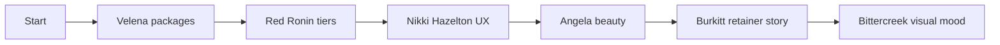

# Site Inspiration Brief — Section Map to index.html

> **For agentic workers:** This is a **reference + optional slice plan**. Do not implement until the user picks sections. When implementing, use `designing-beautiful-websites` + `verification-before-completion`; one section slice at a time.

**Goal:** Short, browsable inspiration brief mapped to every live section in [`index.html`](../index.html), with concrete take/leave guidance and optional micro-tasks per section.

**Architecture:** Section map only — current Artspectiv block → best refs → take/leave → optional task (2–5 min slice). No framework, no new dependencies.

**Tech stack:** Static [`index.html`](../index.html). Reference sites are external browse targets.

**Constraints (do not break):**
- Pricing floors: £445 / £945 / £1,595
- Primary CTA copy: **Request a content shoot**
- Page order: Hero → credibility → problem → offers → Rita → portfolio → process → terms → FAQ → contact
- Scope: content shoots + posting support — **not** full social management or paid ads

**Status:** Reference doc — no implementation tasks selected yet. Name task numbers (0–15) in chat to trigger slices.

---

## Reference index (browse order)

| Priority | Site | URL | Best for |
|----------|------|-----|----------|
| 1 | Velena Lifestyle | https://velenalifestyle.com/restaurant-content-packages/ | Package table, deliverable counts, hospitality |
| 2 | Red Ronin Studios | https://redroninstudios.com/packages/ | Tier ladder naming, café mention |
| 3 | Nikki Hazelton | https://www.nikkihazelton.co.uk/social-media-services | Simple local-business package UX |
| 4 | Angela The Beauty Boss | https://www.angelathebeautyboss.com/content-support | In-salon shoots, capacity scarcity |
| 5 | Burkitt Studio | https://burkittstudio.uk/ | Retainer-as-system storytelling |
| 6 | Bistro Social | https://www.bistrosocial.co.uk/services | Café/bar sector language |
| 7 | videocontentforyou.com | https://www.videocontentforyou.com/ | Reel-first proof grid, booking flow |
| 8 | Bittercreek.Studio | https://bittercreek.studio/ | Editorial dark mood, portfolio grid |
| 9 | Scott Ramsey | https://www.scottramsey.co.uk/content-creation-agency-london | “Brand Stock Library”, fixed-fee clarity |

---

## Section map

### 0. Global design tokens (lines 19–167)

**Current:** Dark editorial (`--bg:#14100c`, gold accent), Cormorant + Inter, subtle reveal motion, mobile sticky CTA.

**Refs:** [Bittercreek.Studio](https://bittercreek.studio/) (editorial grid), [Ottografie](https://ottografie.com/) (photo-first, minimal chrome)

| Take | Leave |
|------|-------|
| Strict grid + restrained UI so photos lead | WebGL, experimental nav, infinite scroll |
| Micro-interactions on cards/hover only | Bright “agency SaaS” palettes |
| Serif display + sans body (already strong) | Heavy animation libraries |

**Optional task 0:** Audit contrast on `.muted` text against `--bg` at mobile; note any WCAG AA gaps in [`docs/design-audit.md`](../docs/design-audit.md) — no CSS change unless fail found.

---

### 1. Header + nav (line 171)

**Current:** Sticky bar, brand “New Barnet”, desktop links, primary CTA in nav.

**Refs:** [Velena](https://velenalifestyle.com/) (clear Packages path), [videocontentforyou.com](https://www.videocontentforyou.com/) (single obvious action)

| Take | Leave |
|------|-------|
| Keep one gold primary CTA visible at all breakpoints | Dual competing CTAs (“Book call” + “Get quote”) |
| Sector anchor in brand line (location = trust) | Mega-menus or blog dropdowns |

**Optional task 1:** Add `#process` or `#terms` to `.links` if user reports scroll confusion — verify 1024px+ only, match existing link pattern.

---

### 2. Hero (lines 173–195)

**Current:** Outcome headline, deliverable stat chip (“24 images + 4 reels”), dual CTA, location/turnaround chips, full-bleed → split hero image on desktop.

**Refs:** [Velena hospitality](https://velenalifestyle.com/hospitality-content-creator/), [Burkitt Studio](https://burkittstudio.uk/), [Red Ronin](https://redroninstudios.com/packages/)

| Take | Leave |
|------|-------|
| Lead with **outcome + deliverable count** (Velena, Red Ronin) | Generic “we create content” without numbers |
| “System / retainer” subline for Monthly buyers (Burkitt) | Stock hero video loops |
| Chips for locality + turnaround (already good) | Unverified awards or follower stats |

**Optional task 2:** A/B copy only — add one line under `.hero-stat`: *“Most independents start with Monthly Content Bank.”* (mirrors Velena retainer default). Verify line length on 390px viewport.

---

### 3. Trust strip (lines 197–210)

**Current:** Three thumb previews + three trust pills (local, platforms, turnaround).

**Refs:** [Scott Ramsey](https://www.scottramsey.co.uk/content-creation-agency-london) (platform readiness), [SeeJee](https://seejee.co.uk/) (process confidence)

| Take | Leave |
|------|-------|
| Platform-specific proof (“IG + Google + booking apps”) | Logo bar of brands you haven’t shot |
| Thumbnail mosaic as visual credibility | Long testimonial in strip |

**Optional task 3:** Swap third thumb to a **salon** asset when `portfolio-beauty-01.jpg` is live — keeps café + beauty balance for dual GTM.

---

### 4. Problem / pain (line 212, `#main-content`)

**Current:** Featured pain card + two supporting cards — dishes not sold visually, inconsistent IG, stale Google photos.

**Refs:** [Bistro Social](https://www.bistrosocial.co.uk/services) (owner pain language), [Salon Socials](https://salonsocials.co.uk/) (booking anxiety)

| Take | Leave |
|------|-------|
| Sector-specific pain (food appetite vs salon trust) | Fear-mongering or “10x growth” claims |
| One featured pain spanning both sectors | More than three cards on mobile |

**Optional task 4:** Add fourth card *or* rotate featured pain by sector using two copy variants — pick one sector per outreach wave (café vs beauty). Single HTML block, no JS A/B.

---

### 5. Offers / packages (line 214, `#offers`)

**Current:** Three productised tiers; Monthly featured with badge; meta-list deliverables + “Best for”.

**Refs:** [Velena restaurant packages](https://velenalifestyle.com/restaurant-content-packages/) (**closest**), [Nikki Hazelton packages](https://www.nikkihazelton.co.uk/social-media-services), [AlphaStudio](https://alphastudio.uk/bespoke-content-creation)

| Take | Leave |
|------|-------|
| **Comparison table** on desktop (Velena’s Menu Spotlight / Content Day / Retainer) | Hiding prices behind “enquire” |
| Explicit deliverable counts (already strong — keep) | Full DM/community management inclusions |
| “Best for” line per tier (Red Ronin pattern) | 3-month minimum unless user approves |

**Optional task 5:** Below `.offers-grid`, add a compact `<table>` or three-column comparison (desktop only) mirroring Velena: Deliverables | Turnaround | Best for — reuse existing `.meta-list` copy, no new pricing.

**Optional task 6:** Rename internal hook only if needed — e.g. align “Monthly Content Bank” subline with commercial doc “Growth” label in `.offer-hook` (copy-only).

---

### 6. Case study — Rita (line 216, `#case-study`)

**Current:** Mosaic grid + featured blockquote + goal/output/proof stack + booking-confidence note.

**Refs:** [SeeJee testimonials](https://seejee.co.uk/), [Burkitt Studio](https://burkittstudio.uk/) (long-form client story), [Velena](https://velenalifestyle.com/) (venue captions)

| Take | Leave |
|------|-------|
| Caption pills on hero mosaic tile (`.ph-caption` — keep) | Before/after metrics unless verified |
| Owner quote above goal/output (already correct) | Multiple case studies before Rita proof is solid |
| “Booking confidence” trust note (unique, keep) | Fake star ratings |

**Optional task 7:** When Rita approves final quote, replace placeholder attribution with signed name/title — single `` edit.

**Optional task 8:** Add one **reel still** tile to mosaic (6th cell) when reel asset exists — extends proof without new section.

---

### 7. Portfolio (line 218, `#portfolio`)

**Current:** Six sector groups, 2-up mobile / 5-col desktop grid, featured wide tile per group.

**Refs:** [Bittercreek.Studio](https://bittercreek.studio/) (explore grid), [videocontentforyou.com](https://www.videocontentforyou.com/) (client booking examples), [Ottografie](https://ottografie.com/) (photo-first)

| Take | Leave |
|------|-------|
| Sector labels (food / beauty / interiors) — already aligned | 30+ images slowing mobile LCP |
| One hero tile per group | Autoplay video reels in grid |
| Lazy loading (already on thumbs) | Unlabeled stock filler |

**Optional task 9:** Collapse to **4 groups** until real assets land (merge People + Details) — reduces placeholder weight per [`docs/image-shot-list.md`](../docs/image-shot-list.md).

---

### 8. Process (line 220)

**Current:** Plan → Shoot → Package — three cards.

**Refs:** [SeeJee](https://seejee.co.uk/) (5-step process), [SalisStudio](https://www.salisstudio.co.uk/) (brief → shoot → delivery)

| Take | Leave |
|------|-------|
| Numbered or icon steps | 7-step agency process |
| “Quiet hours” mention (FAQ already covers) | Timeline graphics that need JS |

**Optional task 10:** Add step numbers `01 / 02 / 03` via `.kicker` above each `h3` — CSS-only, matches existing kicker pattern.

---

### 9. Terms / scope (line 222)

**Current:** Included / Not included / Payment terms — scope boundary clarity.

**Refs:** [Nikki Hazelton](https://www.nikkihazelton.co.uk/social-media-services) (plain package boundaries), [Angela The Beauty Boss](https://www.angelathebeautyboss.com/content-support) (what’s not in monthly)

| Take | Leave |
|------|-------|
| Explicit **Not included** (differentiates from full agencies) | Legal wall of text |
| Deposit split on Starter (already good) | Refund policy unless lawyer-approved |

**Optional task 11:** Add one bullet under Not included: *“Paid Meta/TikTok ad management”* — mirrors FAQ, reduces scope creep enquiries.

---

### 10. FAQ (line 224, `#faq`)

**Current:** Seven `
` — sectors, quiet hours, posting, turnaround, starter entry, beauty, areas.

**Refs:** [Velena FAQ patterns](https://velenalifestyle.com/restaurant-content-packages/), [Bistro Social](https://www.bistrosocial.co.uk/services)

| Take | Leave |
|------|-------|
| Posting-support scope answer (critical) | 15+ questions |
| “Start with one shoot” → Starter upsell path | Duplicate package detail (keep in offers) |

**Optional task 12:** Add FAQ: *“What’s the difference between content only and posting support?”* — 2 sentences, links mentally to contact form `posting_support` field.

---

### 11. Contact / final CTA (line 226, `#contact`)

**Current:** Outcome headline, Formspree form with package + posting selects, 1–2 day reply promise.

**Refs:** [videocontentforyou.com](https://www.videocontentforyou.com/) (WhatsApp/deposit flow), [Velena](https://velenalifestyle.com/restaurant-content-packages/) (enquiry after package clarity)

| Take | Leave |
|------|-------|
| Package pre-select via URL `?package=` (future) | Public email in UI (harness rule) |
| Outcome line “Reply within 1–2 days” | Multi-page enquiry |
| Minimal fields (already good) | Calendly embed (adds JS weight) |

**Optional task 13:** Read `package` query param on load and pre-select `#enquiry-form select[name=package_interest]` — ~8 lines JS, no new dependency.

**Optional task 14:** Smoke-test Formspree on live domain after deploy — [artspectiv-forms](../skills/artspectiv-forms/SKILL.md) checklist.

---

### 12. Sticky CTA + footer (lines 228–229)

**Current:** Mobile-only fixed “Request a content shoot”; minimal footer.

**Refs:** [Unbounce landing patterns](https://unbounce.com/landing-page-examples/best-landing-page-examples/) (single persistent CTA)

| Take | Leave |
|------|-------|
| Sticky CTA on mobile only (already correct) | Sticky on desktop (nav has CTA) |
| Footer locality + domain | Social icon row without active profiles |

**Optional task 15:** Add `padding-bottom` check on iOS Safari with sticky bar — verify no form submit button hidden behind bar at 390px.

---

## What NOT to borrow (site-wide)

- Full **social management** positioning ([KAVARI Kapture](https://kavarikapture.co.uk/), [Salon Socials](https://salonsocials.co.uk/), [Traceline](https://tracelinedigital.com/))
- **Agency-scale retainers** (£3k–£10k) — different capacity model
- **Unverified metrics** (IG followers, awards) — see AGENTS.md gotchas
- Heavy **WebGL / experimental nav** — hurts conversion on static single-file site

---

## Suggested browse session (30 min)

1. Velena — packages table (10 min)
2. Red Ronin — tier naming (5 min)
3. Nikki Hazelton — simple cards (5 min)
4. Angela — salon positioning (5 min)
5. Burkitt — retainer narrative (3 min)
6. Bittercreek — visual mood (2 min)

---

## Verification (when implementing chosen tasks)

- Mobile 390px + desktop 1280px visual pass ([artspectiv-qa](../rules/artspectiv-qa.mdc))
- Grep pricing: no legacy £225/£695/£1,095
- Primary CTA unchanged
- `npm run verify:agent-harness` if AGENTS/PROGRAM touched

---

## Execution choice

**1. Pick tasks** — Name task numbers (e.g. 5, 7, 12) in chat; implement one slice per session.

**2. Browse only** — Use this doc as reference; no `index.html` changes until you request tasks.

**3. Full offers refresh** — Tasks 5–6 + comparison table as a dedicated multi-section slice.
